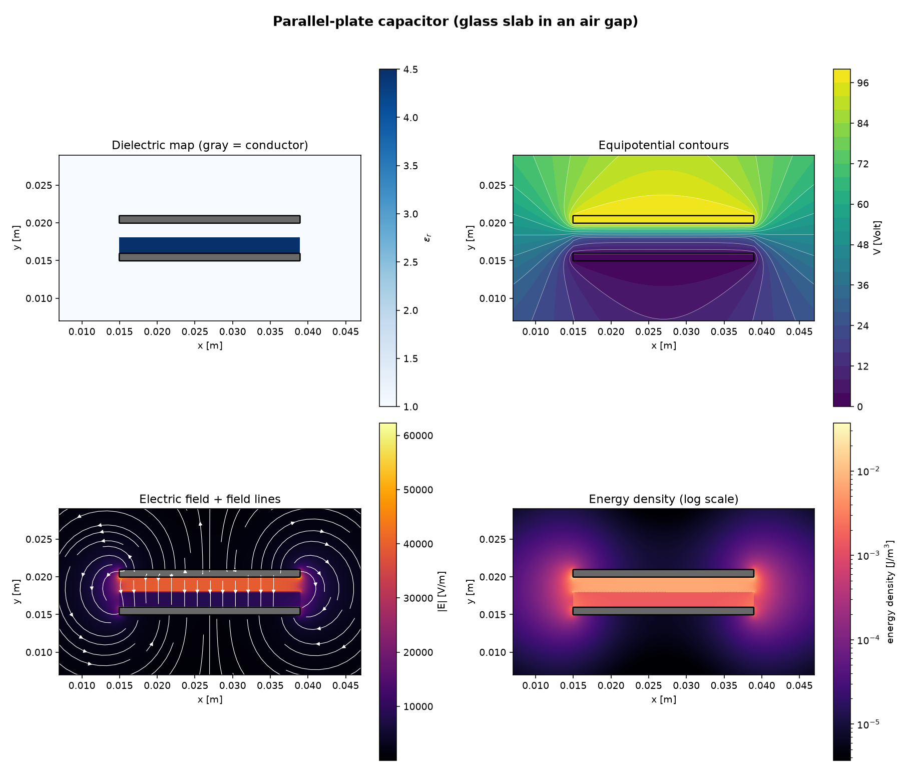
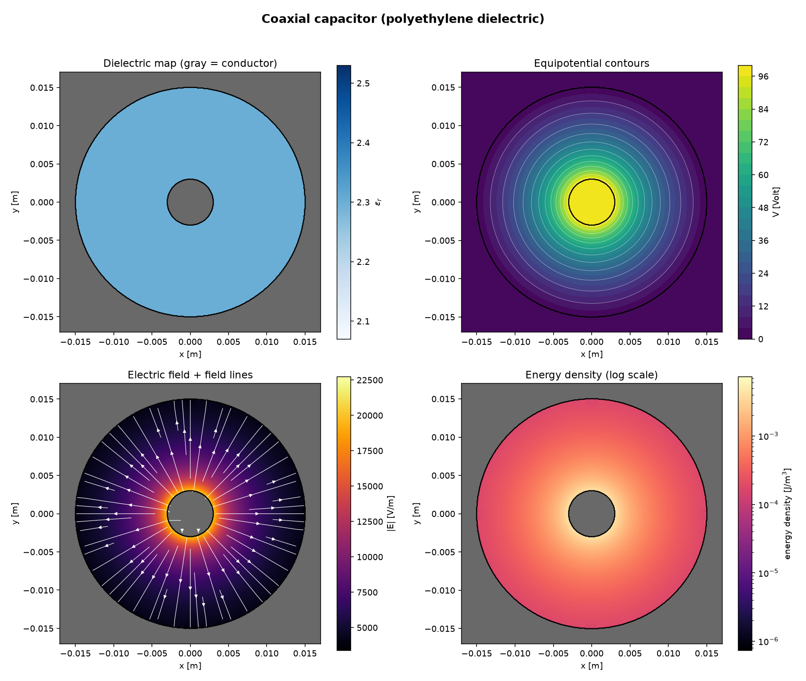

# capacitor-fem

## Remark: Pending update as a result of current version in development

A self-contained 2D finite-element electrostatics solver for simulating real capacitor
geometries — parallel plates, coaxial cables, and arbitrary shapes built from simple
primitives — rather than relying on closed-form formulas that only exist for a handful
of idealized geometries.

Pure NumPy / SciPy / Matplotlib. No mesh-generation library, no compiled extensions,
no native dependencies. One file, runs anywhere.

```bash
python3 capacitor_fem.py
```

This document covers the physics, the mathematics, the numerical method, the software
architecture, and how to use and extend the code. It assumes familiarity with vector
calculus, linear algebra, and Python, but not with finite elements specifically —
the derivation starts from Maxwell's equations and builds up.

## Table of Contents

- [capacitor-fem](#capacitor-fem)
  - [Remark: Pending update as a result of current version in development](#remark-pending-update-as-a-result-of-current-version-in-development)
  - [Table of Contents](#table-of-contents)
  - [1. Overview](#1-overview)
  - [2. Physics: From Maxwell's Equations to the Governing PDE](#2-physics-from-maxwells-equations-to-the-governing-pde)
  - [3. Mathematical Formulation](#3-mathematical-formulation)
    - [3.1 Weak (Variational) Form](#31-weak-variational-form)
    - [3.2 Galerkin Discretization](#32-galerkin-discretization)
    - [3.3 Linear Triangular (P1) Elements](#33-linear-triangular-p1-elements)
    - [3.4 The Element Stiffness Matrix](#34-the-element-stiffness-matrix)
    - [3.5 Dirichlet Boundary Conditions](#35-dirichlet-boundary-conditions)
    - [3.6 Field Recovery and Stored Energy](#36-field-recovery-and-stored-energy)
    - [3.7 Capacitance via the Energy Method](#37-capacitance-via-the-energy-method)
  - [4. Numerical Implementation](#4-numerical-implementation)
    - [4.1 The Mesh](#41-the-mesh)
    - [4.2 Conductors as Filled Regions](#42-conductors-as-filled-regions)
    - [4.3 Grid Alignment: `snap_to_grid`](#43-grid-alignment-snap_to_grid)
    - [4.4 Vectorized Sparse Assembly](#44-vectorized-sparse-assembly)
    - [4.5 Material Assignment](#45-material-assignment)
    - [4.6 Memory and Runtime Scaling](#46-memory-and-runtime-scaling)
  - [5. Software Architecture](#5-software-architecture)
    - [5.1 Module Layout](#51-module-layout)
    - [5.2 Configuration](#52-configuration)
    - [5.3 Geometry and CSG](#53-geometry-and-csg)
    - [5.4 High-Level API](#54-high-level-api)
  - [6. Installation](#6-installation)
  - [7. Usage](#7-usage)
    - [7.1 Running the Examples](#71-running-the-examples)
    - [7.2 Quick Start](#72-quick-start)
    - [7.3 Extending: A New Geometry](#73-extending-a-new-geometry)
  - [8. Validation and Verification](#8-validation-and-verification)
    - [8.1 Exact Analytical Check](#81-exact-analytical-check)
    - [8.2 Mesh Convergence](#82-mesh-convergence)
    - [8.3 Material Quadrature: A Negative Result](#83-material-quadrature-a-negative-result)
  - [9. Worked Examples](#9-worked-examples)
    - [9.1 Parallel-Plate Capacitor with a Partial Dielectric Slab](#91-parallel-plate-capacitor-with-a-partial-dielectric-slab)
    - [9.2 Coaxial Cable](#92-coaxial-cable)
  - [10. Known Limitations](#10-known-limitations)
  - [11. Future Work](#11-future-work)

## 1. Overview

Given a set of conductors at fixed voltages and a (possibly spatially varying)
dielectric filling the space between them, the solver computes the electric
potential $V(x,y)$ everywhere, and from it:

$$\mathbf{E} = -\nabla V \qquad \mathbf{D} = \varepsilon\mathbf{E} \qquad W = \frac{1}{2}\int_\Omega \mathbf{E}\cdot\mathbf{D}\,dA \qquad C = \frac{2W}{(\Delta V)^2}$$

the electric field, displacement, stored energy, and two-conductor capacitance. The
same solver handles a parallel-plate capacitor, a coaxial cable, or any geometry built
from the shape primitives in the code, without changing a line of the physics.

Two design decisions shape everything below, and are worth stating up front because
they explain most of the trade-offs discussed later:

1. **A structured (Cartesian-derived) mesh, not an unstructured/conforming one.**
   This is what keeps the tool dependency-free — no `gmsh`, no compiled mesh
   libraries — at the cost of approximating curved or non-axis-aligned boundaries
   with a staircase of grid cells. Section 10 quantifies exactly what this costs.
2. **Capacitance from stored energy, not from integrating charge along a boundary.**
   The energy method only needs a field that is already computed everywhere in the
   domain; a charge-based method would need to differentiate a numerically noisy
   field *along* a boundary, which amplifies error. See §3.7.

## 2. Physics: From Maxwell's Equations to the Governing PDE

Electrostatics is the time-independent limit of Maxwell's equations. Two of them
are relevant here. Gauss's law relates the electric displacement field to free
charge density $\rho_f$:

$$\nabla\cdot\mathbf{D} = \rho_f$$

and, because there is no time-varying magnetic field, Faraday's law reduces to
$\nabla\times\mathbf{E}=0$. A curl-free field is a gradient field, so it can always
be written in terms of a scalar potential:

$$\mathbf{E} = -\nabla V$$

For a linear, isotropic, non-dispersive dielectric, $\mathbf{D}$ and $\mathbf{E}$
are related by a scalar (position-dependent) permittivity:

$$\mathbf{D} = \varepsilon\,\mathbf{E}, \qquad \varepsilon(x,y) = \varepsilon_0\,\varepsilon_r(x,y)$$

Inside a capacitor's dielectric there is no free charge — all of it resides on the
conductor surfaces, which enter the problem as boundary conditions rather than a
volumetric source term — so $\rho_f = 0$ in the domain and Gauss's law reduces to

$$\nabla\cdot\mathbf{D} = 0$$

Substituting the previous two relations gives the equation the solver actually
solves:

$$\boxed{\ \nabla\cdot\big(\varepsilon\,\nabla V\big) = 0\ }$$

a generalized Poisson equation. When $\varepsilon$ is uniform this is the ordinary
Laplace equation $\nabla^2 V = 0$; allowing $\varepsilon$ to vary in space is what
lets one solver handle mixed dielectrics (glass and air, or a coax cable's
polyethylene fill) without any change to the governing equation.

A conductor in electrostatic equilibrium is an *equipotential region*: any
tangential field along its surface would drive current until it vanished. Each
conductor therefore contributes a Dirichlet boundary condition $V = V_k$ on its
surface, where $V_k$ is the applied voltage.

## 3. Mathematical Formulation

### 3.1 Weak (Variational) Form

The finite element method solves the PDE in *weak* (integral) form rather than
pointwise. Multiply the governing equation by an arbitrary test function $w$ and
integrate over the domain $\Omega$:

$$0 = \int_\Omega w\,\nabla\cdot(\varepsilon\nabla V)\,dA$$

Using the product rule $\nabla\cdot(w\,\varepsilon\nabla V) = w\,\nabla\cdot(\varepsilon\nabla V) + \varepsilon\nabla w\cdot\nabla V$
and the divergence theorem converts this to

$$0 = \oint_{\partial\Omega} w\,\varepsilon\,\frac{\partial V}{\partial n}\,ds \;-\; \int_\Omega \varepsilon\,\nabla w\cdot\nabla V\,dA$$

Restricting $w$ to functions that vanish on the Dirichlet (conductor) boundaries
eliminates that part of the boundary integral. No flux condition is imposed on the
remaining outer domain boundary — this is the weak form's *natural* boundary
condition, corresponding physically to zero prescribed normal displacement there.
What remains is the weak form the solver assembles:

$$\int_\Omega \varepsilon\,\nabla w\cdot\nabla V\,dA = 0 \qquad \text{for every admissible } w$$

This formulation only ever requires *first* derivatives of $V$, unlike the original
PDE which requires second derivatives — the reason piecewise-*linear* elements
(§3.3), whose second derivatives are zero everywhere, are already sufficient.

### 3.2 Galerkin Discretization

Approximate $V$ as a linear combination of a finite set of basis (nodal shape)
functions $N_j$:

$$V(x,y) \approx \sum_j V_j\,N_j(x,y)$$

The Galerkin method chooses the test functions from the *same* basis, $w = N_i$.
Substituting into the weak form for every $i$ turns the continuous PDE into a
finite linear system:

$$\sum_j K_{ij}\,V_j = 0, \qquad K_{ij} = \int_\Omega \varepsilon\,\nabla N_i\cdot\nabla N_j\,dA$$

$K$ is the **global stiffness matrix** — symmetric, sparse (since $N_i$ and $N_j$
overlap only for nodes sharing an element), and singular before boundary
conditions are applied (adding a constant to $V$ everywhere doesn't change the
energy — the classic "floating ground" gauge freedom of a pure-Neumann system).

### 3.3 Linear Triangular (P1) Elements

The domain is triangulated (§4.1), and on each triangle $V$ is approximated as
linear. For a triangle with vertices $(x_1,y_1),(x_2,y_2),(x_3,y_3)$, define

$$b_1=y_2-y_3,\quad b_2=y_3-y_1,\quad b_3=y_1-y_2$$

$$c_1=x_3-x_2,\quad c_2=x_1-x_3,\quad c_3=x_2-x_1$$

$$2A_{\text{signed}} = x_1(y_2-y_3) + x_2(y_3-y_1) + x_3(y_1-y_2)$$

The three linear ("hat") shape functions, each equal to 1 at their own node and 0
at the other two, are

$$N_i(x,y) = \frac{a_i + b_i x + c_i y}{2A_{\text{signed}}}$$

with gradients that are **constant over the element** (a direct consequence of
$N_i$ being linear):

$$\nabla N_i = \frac{1}{2A_{\text{signed}}}\,(b_i,\,c_i)$$

Using the *signed* area here is what makes this formula correct regardless of
whether a triangle's vertices happen to be listed clockwise or counterclockwise:
relabeling the vertices in the opposite order flips the sign of every $b_i,c_i$
*and* of $A_{\text{signed}}$ together, leaving $\nabla N_i$ unchanged — as it must
be, since a shape function's gradient is a geometric property of the triangle, not
an artifact of how its corners happened to be listed. `_triangle_geometry` in the
code computes exactly this.

### 3.4 The Element Stiffness Matrix

Because $\nabla N_i$ is constant per element, the local integral is just the
integrand times the element's area — but here the *unsigned* (physical) area
$|A|$ is needed, since this is a genuine area integral, not a gradient:

$$K^e_{ij} = \varepsilon_e \int_{\Omega_e} \nabla N_i\cdot\nabla N_j\,dA = \varepsilon_e\,\frac{b_i b_j + c_i c_j}{4\,|A|}$$

Assembly sums each element's $3\times 3$ local matrix into the global $K$ at the
corresponding global node indices — standard finite-element scatter-add,
detailed as an implementation matter in §4.4.

### 3.5 Dirichlet Boundary Conditions

Partition the nodes into **fixed** (Dirichlet, voltage known) and **free**
(unknown) sets. The assembled system $KV=0$ block-partitions as

$$\begin{pmatrix}K_{ff} & K_{fd}\\ K_{df} & K_{dd}\end{pmatrix}\begin{pmatrix}V_f\\ V_d\end{pmatrix} = \begin{pmatrix}0\\ \cdot\end{pmatrix}$$

Only the free-node block equations are meaningful constraints on the unknowns
(the fixed-node rows aren't equations to solve, since $V_d$ is already known), so
the system actually solved is the reduced one:

$$K_{ff}\,V_f = -K_{fd}\,V_d$$

which is exactly what `apply_conductors_and_solve` builds and hands to
`scipy.sparse.linalg.spsolve`.

### 3.6 Field Recovery and Stored Energy

Since $V$ is piecewise linear, $\mathbf{E}=-\nabla V$ is exactly piecewise
**constant** per element — not an approximation layered on top of the P1
solution, but a direct property of it:

$$\mathbf{E}_e = -\frac{1}{2A_{\text{signed}}}\sum_{i=1}^{3} V_i\,(b_i, c_i), \qquad \mathbf{D}_e = \varepsilon_e\,\mathbf{E}_e$$

$$w_e = \frac{1}{2}\,\mathbf{E}_e\cdot\mathbf{D}_e \quad \text{(J/m}^3\text{, per element)}, \qquad W = \sum_e w_e\,|A_e| \quad \text{(J/m)}$$

$W$ comes out in **joules per meter of depth**, not joules — this is a 2D solve,
implicitly representing a geometry that extrudes uniformly into the page. All
capacitance values in this project are per unit depth (F/m) for the same reason;
multiply by an actual depth to get total farads.

### 3.7 Capacitance via the Energy Method

For a two-conductor system carrying charge $+Q$ and $-Q$ at potentials $V_1,V_2$,
electrostatic energy and capacitance are related by

$$W = \frac{1}{2}Q\,\Delta V = \frac{1}{2}C(\Delta V)^2 \qquad\Longrightarrow\qquad C = \frac{2W}{(\Delta V)^2}$$

This is preferred over integrating $\mathbf{D}\cdot\mathbf{n}$ along a conductor's
boundary to recover $Q$ directly: the energy method only needs the volume integral
of a field the solver has already computed everywhere (§3.6), while a boundary-flux
method needs the field evaluated *specifically at* a boundary, which is exactly
where a non-conforming mesh (§10) is least accurate — differentiating a noisy
field along the noisiest part of the domain is a bad combination.

## 4. Numerical Implementation

### 4.1 The Mesh

The mesh is a plain `nx`-by-`ny` Cartesian grid of nodes, with every grid cell
split into two triangles. The diagonal alternates in a checkerboard pattern (not
always the same direction) specifically to avoid a built-in directional bias in
the discretization:

```text
////        instead of        ////
\\\\                          ////
////                          ////
\\\\                          ////
```

This needs no external mesh-generation library — the entire mesh is `numpy.linspace`
plus index arithmetic — which is what makes the script dependency-free. The cost is
that the mesh cannot *conform* to a curved or non-axis-aligned boundary; see §10.

### 4.2 Conductors as Filled Regions

Rather than meshing only the dielectric and applying Dirichlet conditions on the
boundary contour of a hole (as a conforming mesh would), every mesh node that
falls *inside* a conductor's shape is simply marked as a Dirichlet node at that
conductor's voltage. This is exact for a triangle entirely inside a conductor —
all three nodes share one voltage, so $V$ is constant across it, $\mathbf{E}=0$
identically, and it contributes exactly zero to the stored energy regardless of
what material it happens to be assigned. It is only approximate for the thin
layer of triangles straddling a conductor's boundary (§10.3).

### 4.3 Grid Alignment: `snap_to_grid`

A subtle but important point discovered during development: if a conductor's
edge falls *between* two grid lines, it gets silently rounded to the nearer one
when nodes are classified as inside/outside. Left unaddressed, this changes the
simulated gap of a parallel-plate capacitor by a fraction of a grid cell — in an
early version of this code, before the fix, this alone produced a 5–9% error in
the effective simulated gap depending on resolution, comparable in size to the
physical effects (fringing) the simulation was meant to reveal.

```python
def snap_to_grid(target, h):
    return round(target / h) * h
```

Every feature size in both worked examples is passed through this before
geometry is constructed, so "intended size" and "simulated size" match exactly
for any grid spacing `h`. This is also what makes a mesh-convergence sweep
(varying `h` while the physical geometry should stay fixed) actually test
convergence, instead of silently rescaling the whole problem along with the mesh.

### 4.4 Vectorized Sparse Assembly

Element stiffness matrices are computed for every triangle at once with NumPy
broadcasting, producing three parallel arrays — row indices, column indices,
values — which are handed directly to SciPy's `csr_matrix((data, (row, col)))`
constructor. That constructor sums duplicate `(row, col)` entries internally,
which is exactly the assemble-as-triplets-then-convert-once pattern recommended
in finite-element practice, rather than inserting into a sparse matrix one
element at a time (a much slower pattern, since sparse matrix mutation triggers
data-structure rebuilds).

### 4.5 Material Assignment

`evaluate_material` samples $\varepsilon_r$ once, at each triangle's centroid.
This is exact for a triangle lying entirely inside one material region — and, as
established in §8.3, for an *axis-aligned* region whose edges have been snapped
to the grid, it is in fact exact *everywhere*, not just "mostly." Real ambiguity
only arises for boundaries that cannot be grid-aligned (a circle), and even there,
refining the sampling was measured to make a negligible difference, since the
conductor boundary's own node classification dominates the error (§8.3).

### 4.6 Memory and Runtime Scaling

Because the mesh is a uniform Cartesian grid (§4.1), node count grows as
$1/h^2$ — halving $h$ quadruples the mesh, everywhere, whether or not the field
actually needs that resolution there. Combined with `apply_conductors_and_solve`
calling `scipy.sparse.linalg.spsolve` — a general (non-symmetric) sparse LU
factorization, even though the underlying stiffness matrix is symmetric
positive definite — peak memory was measured to grow *faster* than linear in
node count:

|       $h$ |   nodes | measured peak RSS |
| --------: | ------: | ----------------: |
|  0.300 mm |  12,996 |            108 MB |
|  0.150 mm |  51,984 |            184 MB |
|  0.075 mm | 206,116 |            523 MB |
| 0.0375 mm | 824,464 |           1.75 GB |

Fitting a power law to these four points gives peak RSS $\approx 0.14 \times
\text{nodes}^{0.68}$ MB — extrapolating (not measured directly, to avoid risking
an out-of-memory crash while writing this) puts roughly 2 million nodes ($h
\approx 30\,\mu\text{m}$ on the coax domain) at about 2 GB, and roughly 11.5
million nodes ($h = 10\,\mu\text{m}$) at close to 9 GB. Both shipped examples,
at their production resolution, sit at roughly 0.5 GB or less — comfortably
below where this becomes a practical concern — but pushing `mesh_spacing` an
order of magnitude finer than the shipped defaults (e.g. from $10^{-4}$ to
$10^{-5}$) can plausibly exceed a typical laptop's RAM. `Mesh.__init__` prints a
non-blocking heads-up (via `_warn_if_large_mesh`) above roughly 1 million nodes,
with a more prominent warning above 5 million, using this same fitted estimate.
Treat the estimate as a ballpark for deciding whether to worry, not a
guarantee — actual memory depends on the machine, BLAS/LAPACK build, and
problem specifics.

The available levers, roughly in order of effort: use a coarser `mesh_spacing`
(the immediate fix, no code change needed); a solver that exploits the matrix's
symmetry, or an iterative solver instead of a direct one, both of which leave
the mesh untouched; or, most fundamentally, an unstructured/graded mesh that
only spends nodes where the field actually needs them. See §11 for what each of
these three actually costs and trades off — the mesh option is the same one
discussed throughout §10, the other two are new, solver-level alternatives
unrelated to mesh choice.

## 5. Software Architecture

### 5.1 Module Layout

```text
1. CONFIGURATION    ParallelPlateConfig, CoaxConfig, PlotConfig
2. GEOMETRY         Shape (base, with CSG |, &, - operators),
                     Circle / Rectangle / OutsideCircle
3. MATERIALS        Material, make_eps_r_function()
4. MESH             snap_to_grid(), structured triangular Mesh
5. SOLVER           evaluate_material(), assemble_stiffness(),
                     apply_conductors_and_solve()
6. POST-PROCESSING  compute_fields(), capacitance_from_energy()
7. HIGH-LEVEL API   ElectrostaticProblem
8. VISUALIZATION    plot_solution()
9. EXAMPLES         parallel-plate capacitor, coaxial cable
```

Each section is deliberately small and depends only on the interfaces of the
sections before it — `assemble_stiffness` doesn't know or care how the mesh was
built, `plot_solution` doesn't know or care what kind of shapes the conductors
are. This is what makes each piece independently replaceable (§11).

### 5.2 Configuration

Every physical dimension, material property, and numerical tuning parameter for
the two worked examples is a field on a frozen `dataclass`, rather than a bare
literal buried in a function body:

```python
from capacitor_fem import ParallelPlateConfig
import dataclasses

default = ParallelPlateConfig()                          # the shipped example
custom = ParallelPlateConfig(dielectric_eps_r=9.8,        # e.g. a ceramic instead of glass
                              gap=2e-3,
                              mesh_spacing=0.05e-3)        # convergence_spacings follows automatically
also_custom = dataclasses.replace(default, gap=2e-3)      # copy-with-override
```

Configs are frozen (immutable) — construct a new one to change a value. Each
config validates itself on construction: `convergence_spacings[-1]` must equal
`mesh_spacing`, since the finest sweep level is reused as the production
resolution for the final report and plot, and a silent mismatch there would be a
confusing way to fail. Changing `mesh_spacing` alone, as above, doesn't hit that
error — if `convergence_spacings` is left untouched, a fresh sweep is derived
automatically from the new `mesh_spacing`, using the same coarse-to-fine ratios
as the shipped default. Passing an explicit `convergence_spacings` still works
exactly as before and is still validated: only the *default* value is treated as
"untouched, please adapt it," so a genuine typo in a custom tuple is still
caught rather than silently overridden.

That auto-derivation is deliberately conservative about *how* it's triggered.
An earlier version of this mechanism instead used a `None` sentinel default and
recomputed `convergence_spacings` via `ratio * mesh_spacing` arithmetic on
every construction — including the ordinary, untouched-default case. That
turned out to be a real problem, not just a style choice: multiplying out a
ratio does not reliably reproduce a literal tuple's exact floating-point bit
pattern (e.g. `1.5 * 0.1e-3` is not bit-identical to the literal `0.15e-3`,
differing at the last representable bit). Because every conductor and material
edge in this project is deliberately snapped to land exactly on a grid line
(`snap_to_grid`, §4.3), a last-bit difference in a boundary coordinate can flip
an entire row of mesh nodes across a `Shape.contains()` `<=`/`>=` comparison —
found in practice by testing this exact mechanism: an arithmetically
"equivalent" `h` reclassified one full row of nodes as conductor, changing a
reported capacitance by several percent, for the *default* configuration. The
fix was to make the field's default the literal tuple again (so the well-tested
default path is bit-for-bit unchanged and provably carries zero risk of this)
and trigger the ratio-derivation only when `mesh_spacing` has changed while
`convergence_spacings` is detected as still equal to that literal default. See
§10.4 for this as a general limitation, independent of this specific fix.

### 5.3 Geometry and CSG

Every shape implements one method, `contains(x, y)`, returning a boolean mask.
That is the *entire* interface the rest of the code relies on — assembly calls
it at triangle centroids, the solver calls it at mesh nodes, plotting calls it on
a full grid. Shapes compose with ordinary set operators:

```python
from capacitor_fem import Circle, Rectangle

annulus = Circle((0, 0), 10e-3, eps_r=4.5) - Circle((0, 0), 6e-3)   # a - b: difference
union = Circle((0, 0), 5e-3) | Rectangle(0, 0, 10e-3, 10e-3)         # a | b: union
both = Circle((0, 0), 5e-3) & Rectangle(0, 0, 10e-3, 10e-3)          # a & b: intersection
```

each returning a new `Shape` whose `contains()` combines the operands' with the
matching NumPy boolean operator — no other code needs to change to support a
composite shape, since nothing downstream ever inspects a shape's concrete type.

### 5.4 High-Level API

`ElectrostaticProblem` is a thin facade over the module-level pipeline. Calling
`.solve()` runs exactly these four calls, in this order, and stores the results
as attributes — this is the whole method, not a simplification of it:

```python
self.eps_r_of_xy = make_eps_r_function(self.dielectrics, self.background_eps_r)
eps_elem = evaluate_material(self.mesh, self.eps_r_of_xy)
K, area, area2, b, c = assemble_stiffness(self.mesh, eps_elem)
self.V, self.is_fixed, self.solve_time = apply_conductors_and_solve(self.mesh, K, self.conductors)
... = compute_fields(self.mesh, self.V, eps_elem, b, c, area, area2)
```

Nothing there is new numerics — it's the same four functions from SOLVER and
POST-PROCESSING, called for you. From outside, using the facade looks like this:

```python
from capacitor_fem import ElectrostaticProblem, Mesh, Circle, OutsideCircle

mesh = Mesh(x0=-17e-3, y0=-17e-3, Lx=34e-3, Ly=34e-3, nx=454, ny=454)

problem = ElectrostaticProblem(mesh)
problem.add_conductor(Circle((0, 0), 3e-3), voltage=100.0)
problem.add_conductor(OutsideCircle((0, 0), 15e-3), voltage=0.0)
problem.add_dielectric(Circle((0, 0), 15e-3), eps_r=2.3)
problem.solve()

print(problem.capacitance(100.0, 0.0) * 1e12, "pF/m")
```

`nx=454` here is not arbitrary — it's `round(2 × 17e-3 / 0.075e-3) + 1`, the same
formula `_solve_coax` uses for example 2's production mesh spacing, and this
snippet reproduces its result exactly: **78.910 pF/m**, matching section 9.2.

Neither worked example in section 9 actually uses `ElectrostaticProblem` —
`_solve_coax` and `_solve_parallel_plate` call the four pipeline functions
directly instead, since spelling out every step is the point of a worked
example. Use the facade when setting up a *new* problem and you don't want to
restate the pipeline each time; call the functions directly when you want to
see or modify what happens at each individual step, the way both examples do.

The facade contains no numerics of its own beyond what's already in SOLVER and
POST-PROCESSING — verified by testing it against the equivalent manual pipeline
call on the coax problem and confirming bit-for-bit identical output.

## 6. Installation

```bash
pip install numpy scipy matplotlib
```

Python 3.8 or later (uses `dataclasses`, f-strings, and standard type hints; no
newer syntax). No compiled extensions, no system packages, no `gmsh`.

## 7. Usage

### 7.1 Running the Examples

```bash
python3 capacitor_fem.py
```

Runs both worked examples end-to-end: a mesh-convergence sweep, a comparison
against each geometry's analytical formula, and a four-panel summary figure
(`example1_parallel_plate.png`, `example2_coax.png`). Takes roughly 15–30
seconds on a modern laptop, dominated by the finest resolution in each
convergence sweep.

### 7.2 Quick Start

```python
from capacitor_fem import ParallelPlateConfig, example_parallel_plate, CoaxConfig, example_coax

# Run with the defaults shown in this README:
C, C_ideal = example_parallel_plate()

# Or override any parameter:
C, C_ideal = example_coax(CoaxConfig(dielectric_eps_r=1.0))   # air-filled instead of PE
```

Or use the low-level pipeline directly for full control — see §5.4 and the
in-code docstrings on `evaluate_material`, `assemble_stiffness`,
`apply_conductors_and_solve`, and `compute_fields` for the complete call
signatures and what each returns.

### 7.3 Extending: A New Geometry

1. Build the shapes: any combination of `Circle`, `Rectangle`, `OutsideCircle`,
   and CSG-composed shapes (§5.3), or a new `Shape` subclass if `contains()`
   needs different logic (an ellipse, a polygon, an imported outline).
2. Assign each shape a `voltage` (conductor) and/or `eps_r` (dielectric region).
3. Build a `Mesh` spanning a domain comfortably larger than the geometry.
4. Either call the four-function pipeline directly, or use
   `ElectrostaticProblem` (§5.4).
5. If precision matters, run a convergence sweep the way both examples do —
   several `Mesh` resolutions, same geometry, watch how the answer moves
   (§8.2) — rather than trusting a single resolution.

No part of this requires touching `assemble_stiffness`, `compute_fields`, or
`plot_solution`.

## 8. Validation and Verification

Claims about accuracy in this project are backed by specific, reproducible
numbers, not general assurances. This section is those numbers.

### 8.1 Exact Analytical Check

A parallel-plate capacitor whose plates span the *entire* simulation domain in
$x$ is translationally invariant — no fringing is even geometrically possible —
so its exact capacitance per unit depth is the elementary formula
$C' = \varepsilon_0\varepsilon_r L_x / d$, with no approximation on the physics
side to compare against. Running the full assembly/solve/energy pipeline against
this case at four mesh resolutions ($h=$ 0.5, 0.25, 0.125, 0.0625 mm) reproduced
the exact value to **0.0000% error at every resolution tested**. This isolates
and confirms the core FEM machinery (assembly, boundary conditions, energy
integration) is free of implementation bugs, independent of the mesh's ability to
represent curved or finite-width geometry.

### 8.2 Mesh Convergence

Both worked examples run a convergence sweep before reporting a final answer,
and the two behave characteristically differently:

**Coaxial cable** (smooth circular boundary, no sharp corner) — monotonic
across the five resolutions tested below, converging toward the analytical
value as $h$ shrinks:

| $h$ (mm) |   nodes | $C$ (pF/m) |  error |
| -------: | ------: | ---------: | -----: |
|    0.300 |  12,996 |     77.311 | −2.76% |
|    0.200 |  29,241 |     77.813 | −2.12% |
|    0.150 |  51,984 |     78.495 | −1.27% |
|    0.100 | 116,281 |     78.593 | −1.14% |
|    0.075 | 206,116 |     78.910 | −0.75% |

**Parallel plate** (sharp conductor corner) — the same solver, same
convergence-testing code, deliberately *not* forced to look clean:

| $h$ (mm) |   nodes | $C$ (pF/m) | change |
| -------: | ------: | ---------: | -----: |
|    0.400 |  12,467 |     88.805 |      — |
|    0.200 |  49,051 |     93.909 | +5.75% |
|    0.150 |  87,362 |     93.045 | −0.92% |
|    0.100 | 195,301 |     97.657 | +4.96% |

This second sequence is **not monotonic** (confirmed programmatically at
runtime by `_describe_convergence`, not asserted in a comment) — it changes
direction twice. Given §8.1 rules out an implementation bug, this is a genuine
numerical characteristic worth understanding: the field concentrates sharply at
the plate's corner (a geometric singularity), and each $h$ above is an
*independent* structured mesh rather than a nested refinement of the previous
one (the checkerboard diagonal pattern doesn't align between resolutions), so
the usual guarantee that Galerkin FEM energy decreases monotonically under mesh
refinement — which relies on each finer mesh's basis functions being a strict
superset of the coarser one's — does not apply between them. Treat the finest
level's answer as accurate to roughly the spread shown in the table, not to
its last printed digit.

A caveat on the coax table's monotonicity, worth stating precisely rather than
leaving implied: it describes the five *specific* resolutions tested, not a
general property of this example. Filling in intermediate resolutions (0.25,
0.175, 0.125, and 0.0875 mm, each independently re-verified) finds two further
reversals the published sweep steps over — 0.300 mm to 0.250 mm decreases by
0.39 pF/m, and 0.150 mm to 0.125 mm decreases by 0.22 pF/m. This is the same
mechanism as the parallel-plate case above (independent, non-nested structured
meshes), just far smaller in magnitude here — roughly 0.3-0.5% versus up to
several percent for the plate's corner-driven swings, since a smooth circular
boundary has no singularity to amplify the effect. The practical conclusion —
coax converges markedly better-behaved than the plate — still holds; "clean"
or unqualified "monotonic" as a property of the *method*, rather than of the
specific five points shown, does not.

### 8.3 Material Quadrature: A Negative Result

Worth documenting precisely because the first attempt at this looked like a real
improvement and turned out not to be — the kind of thing worth writing down so
it doesn't get rediscovered the hard way.

Sampling a triangle's material at its centroid (§4.5) versus at several points
and averaging sounds like it should improve accuracy for boundary-straddling
triangles. Sampling at the centroid plus the three edge midpoints on the
parallel-plate glass/air interface initially showed a **+2.14% shift** in
capacitance — but tracing it down, the shift came entirely from edge midpoints
landing *exactly on* the material boundary itself. Because that boundary was
already snapped to the grid (§4.3), it coincides exactly with triangle edges, so
those edge-midpoint samples sit precisely on a zero-area line, and their
"inside" classification (per the boundary convention $y \le y_0$) was pure sampling
artifact, not a real area split — the true source of the flawed test was double
counting a boundary with zero measure.

A corrected scheme sampling only *interior* points (avoiding this degeneracy),
tested at up to 64 points per triangle, changed the parallel-plate answer by
**exactly zero** — consistent with §4.3's snap-to-grid alignment eliminating
genuine straddling for axis-aligned regions entirely. On the coax example, where
the dielectric-fill boundary is circular and cannot be grid-aligned, the same
corrected scheme moved the answer by about **0.001 percentage points** (from
−0.7459% error at 1 sample point to −0.7448% at 64) — real, but two orders of
magnitude smaller than the ≈0.75% error from the conductor boundary's own node
classification, which finer material sampling doesn't touch. **Conclusion:**
multi-point material quadrature is not a worthwhile addition to this codebase as
it stands; the conductor boundary itself (§10.1) is the binding constraint.

## 9. Worked Examples

### 9.1 Parallel-Plate Capacitor with a Partial Dielectric Slab

Two rectangular plates (24 mm × 1 mm, 4 mm gap, 100 V applied), with a
2 mm-thick glass slab ($\varepsilon_r=4.5$) filling the lower half of the gap
and air ($\varepsilon_r=1.0$) filling the rest — a rectilinear geometry with a
spatially varying dielectric, compared against the ideal series-dielectric
formula $C'_{\text{ideal}} = \varepsilon_0 w \big/ (d_1/\varepsilon_{r1} + d_2/\varepsilon_{r2})$
(fringing-free by construction). At production resolution ($h=0.1$ mm,
195,301 nodes): **97.657 pF/m** FEM versus **86.932 pF/m** ideal, a **+12.34%**
difference — expected and correct, since the FEM solution also captures
fringing fields at the plate edges that the ideal formula ignores by
construction (see the field-line panel below).



### 9.2 Coaxial Cable

A polyethylene-filled ($\varepsilon_r=2.3$) coaxial cable, inner conductor
radius 3 mm at 100 V, outer conductor radius 15 mm at 0 V — a curved geometry,
compared against the standard formula
$C' = 2\pi\varepsilon_0\varepsilon_r \big/ \ln(b/a)$. At production resolution
($h=0.075$ mm, 206,116 nodes): **78.910 pF/m** FEM versus **79.503 pF/m**
analytical, a **−0.75%** difference, attributable entirely to the staircase
approximation of the circular boundary (§8.2, §10.1).



## 10. Known Limitations

The finite-element formulation itself is validated, not just asserted (§8.1,
§8.2). The first three limitations below are specifically about the
*mesh* and trace back to one design choice: a structured, non-conforming mesh,
chosen so this project has no native dependencies (§1). The fourth is a
related but distinct fragility in how conductor and material boundaries are
*classified* on that mesh, independent of mesh resolution.

**10.1 — Non-conforming (structured) mesh.** Curved or non-axis-aligned
boundaries are approximated by a staircase of grid cells with $O(h)$
approximation error. Directly measured in §8.2's coax table: error shrinks
steadily from −2.76% to −0.75% as $h$ goes from 0.3 mm to 0.075 mm.

**10.2 — Corner singularities are under-resolved by a uniform mesh.** The field
concentrates sharply at a conductor's sharp corner, and a uniform mesh spends
most of its resolution far from where it's actually needed. Compounded by
independent structured meshes at different $h$ not being *nested* refinements of
one another (§8.2), so the usual Galerkin monotonic-convergence guarantee
doesn't apply between them — directly visible in §8.2's non-monotonic
parallel-plate table.

**10.3 — Material-interface and conductor-boundary triangles have an $O(h)$
assignment ambiguity — for boundaries that cannot be grid-aligned.** For an
axis-aligned region whose edges are snapped to the grid (§4.3), this is in fact
exact everywhere: no triangle in either worked example genuinely splits between
materials (§8.3). Real straddling occurs only for the coax's circular
boundaries, where it is a small (§8.3), measured source of mesh-dependence — and
where refining the *material* sampling doesn't help, since the conductor
boundary's own node classification dominates.

**10.4 — Boundary classification is sensitive to the last bit of floating-point
precision, independent of mesh resolution.** `snap_to_grid` (§4.3) deliberately
makes conductor and material edges land exactly on grid lines, and
`Shape.contains()` classifies nodes with strict `<=`/`>=` comparisons against
those edges. Both are correct in exact arithmetic, but in floating-point
arithmetic, two *mathematically equivalent* ways of computing "the same"
boundary coordinate — e.g. a literal `0.15e-3` versus an arithmetically derived
`1.5 * 0.1e-3`, which differ at the last representable bit — can round to
different floats, and a `<=`/`>=` test evaluated at that coordinate can then
flip for an *entire row or column* of nodes at once, since every node in that
row shares the same coordinate. This is not hypothetical: it was found while
building the `mesh_spacing` → `convergence_spacings` auto-derivation in §5.2,
where an earlier version of that mechanism reclassified one full row of nodes
as conductor for the *default* parallel-plate configuration, changing the
reported capacitance by several percent. The fix there was to keep the
default construction path on the exact literal values this project's results
are validated against (§5.2), which is a mitigation for that specific case,
not a general one — the underlying sensitivity is a property of comparing
independently-computed floats at a shared boundary, and could in principle
recur wherever a boundary coordinate is computed two different ways. A
proper fix needs either tolerance-based classification (accept a node as
"on the boundary" within some epsilon, rather than by exact comparison) or a
conforming mesh where a boundary node's position and the boundary's position
are the same computation by construction, not two values compared after the
fact — the latter is the same unstructured-mesh direction as 10.1.

## 11. Future Work

Ordered roughly by leverage (how much of §10 it addresses) against cost (new
dependencies, implementation complexity):

- **Unstructured, conforming, adaptively refined mesh.** The highest-leverage
  change available, addressing 10.1–10.3 at once, and 10.4 as a side effect
  (node position and boundary position become the same computation, not two
  values compared after the fact): a mesh generator (e.g. `pygmsh`, building on
  `gmsh`) that conforms exactly to curved/sharp boundaries and clusters
  resolution near conductor edges and corners. `assemble_stiffness` and
  `compute_fields` are already agnostic to how the mesh was built — they only
  consume `mesh.points` and `mesh.triangles` — so this is a `Mesh`-class swap,
  not a solver rewrite. It does add `gmsh` as a native dependency, which is why
  it isn't included by default.

- **Tolerance-based boundary classification — a small, targeted fix for 10.4
  specifically.** Replace `Shape.contains()`'s exact `<=`/`>=` comparisons with
  a small-epsilon tolerance, so a node "on" a boundary is classified
  consistently regardless of which of two equivalent arithmetic paths produced
  its coordinate. Narrow in scope (doesn't touch 10.1–10.3) but cheap and
  dependency-free; worth doing independently of the larger mesh changes below,
  since 10.4 can in principle affect any future code path that computes a
  boundary coordinate a new way, not just the one instance found so far.

- **Graded (non-uniform) structured mesh — a concrete, dependency-free
  intermediate step.** Keep the Cartesian, dependency-free mesh, but space grid
  lines more finely near conductor edges and corners and more coarsely away from
  them (e.g. via geometric or `tanh` stretching along each axis) instead of the
  uniform spacing used throughout this project. This is the one lever that would
  still meaningfully tighten the parallel-plate corner numbers in §8.2/§10.2
  without adding a dependency — it directly targets the under-resolution
  described there. It does *not* address §10.1, since a graded Cartesian grid
  still cannot conform to a curved boundary; only an unstructured mesh does that.
  The cost is implementing and validating a grading scheme correctly (a real,
  bounded piece of engineering, not a config toggle).

- **Boundary-represented conductors.** Mesh only the dielectric region and apply
  the Dirichlet condition on the boundary contour of a hole, instead of filling
  the conductor's interior with fixed-voltage nodes. Removes §10.3, and is the
  right foundation for surface-charge-density or Maxwell-stress-tensor output,
  both of which want a well-defined boundary contour to evaluate along. Requires
  the unstructured mesh above to cut a conforming hole.

- **Cut-cell (sub-cell) boundary treatment.** A smaller alternative that stays on
  a Cartesian grid: compute the actual area fraction of a boundary-straddling
  triangle in each region and weight its contribution accordingly, instead of
  a hard inside/outside classification. Reduces §10.3 without changing the mesh,
  but is a real numerical method (correct partial-area integration over a
  clipped triangle) rather than a small tweak.

- **Quadratic (P2) elements.** Worth doing together with the unstructured mesh,
  not before it: on a non-conforming mesh, the dominant error on a curved
  boundary is geometric, not the PDE-discretization error a higher element
  order addresses. Needs curved ("isoparametric") boundary elements to pay off
  as expected — a bigger change than plain P2, which just adds 6-node elements
  and real quadrature without reshaping a staircased boundary into a circle.

- **Nonlinear dielectrics**, $\varepsilon(E)$: read the field from the previous
  iteration and Picard-iterate `evaluate_material → assemble_stiffness → solve →
  compute_fields` to convergence — the split between `evaluate_material` and
  `assemble_stiffness` exists specifically to make this a small addition.

- **Anisotropic (tensor) permittivity**: replace the scalar `eps_elem` multiply
  in `assemble_stiffness` with a per-element $2\times2$ tensor contracted
  against the $(b,c)$ gradient coefficients.

- **Floating conductors and general boundary-condition types.** Useful once
  Neumann or floating-potential conductors are needed — a floating conductor
  adds an extra unknown and a total-charge constraint to the linear system, a
  real numerical feature. Worth introducing `DirichletBC`/`NeumannBC`/
  `FloatingConductor` objects together with that work.

- **3D / tetrahedral elements**: the same weak form and the same assembly
  pattern, with 4-node tetrahedral shape functions in place of 3-node triangles.

Everything above is ordered by how much of §10 (accuracy) it addresses. The
two items below are a different axis entirely — memory and runtime (§4.6) —
and don't change accuracy at all:

- **Symmetry-aware direct solver.** `apply_conductors_and_solve` uses
  `scipy.sparse.linalg.spsolve`, a general (non-symmetric) sparse LU
  factorization, even though the stiffness matrix is symmetric positive
  definite. A Cholesky-based solver aware of that (e.g.
  `scikit-sparse`/`CHOLMOD`) does roughly half the factorization work and needs
  less memory for the same mesh — no change to node count or accuracy, purely a
  linear-algebra efficiency gain. Not included by default for the same reason
  `gmsh` isn't: it's a new native dependency.

- **Iterative solver.** Since the matrix is SPD, conjugate gradient is a valid
  alternative to a direct solve, with memory that scales with problem size
  directly rather than the superlinear growth measured in §4.6 (no
  factorization fill-in). A real trade-off, not a strict improvement: unlike
  the current one-shot, exact direct solve, CG needs a convergence tolerance
  and, without a decent preconditioner, can converge slowly or unpredictably on
  this kind of problem — swapping it in naively could trade a clear memory
  error for a worse failure mode (a run that never finishes, with no clear
  signal why).
